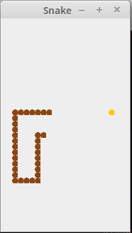
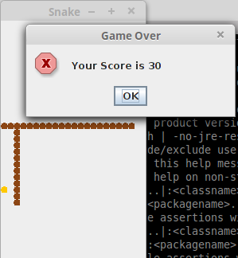

# Simple Snake Game in Java

This is fresh repo for my old code of [Snake Game][1]. 

# Specification

🐍 Snake game is written in pure Java code. Also using some ArrayList, Graphics and Container Classes.

# Command to run

```sh
$ javac snake.java
$ java snake
```

# Below are the screenshots of the same.





# Author

[Bhagyesh Sunil Patel][2] This was developed by me in Oct 15th, 2014


[//]: # (These are reference links used in the body of this note)

[1]: https://github.com/uzrnem/SourceFiles/blob/master/Snake.java
[2]: https://github.com/uzrnem
