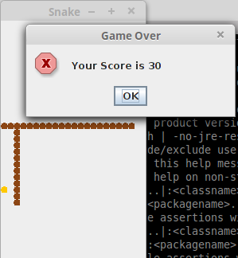

# Simple Snake Game in Java

This is fresh repo for my old code of Snake Game. This was developed by me in Oct 15th, 2014.

# Specification

🐍 Snake game is written in pure Java code. Also using some ArrayList, Graphics and Container Classes.

# Command to run

```sh
$ javac Snake.java
$ java Snake
```

# Below are the screenshots of the same.




# Author

[Bhagyesh Sunil Patel][1]

[1]: https://github.com/uzrnem
